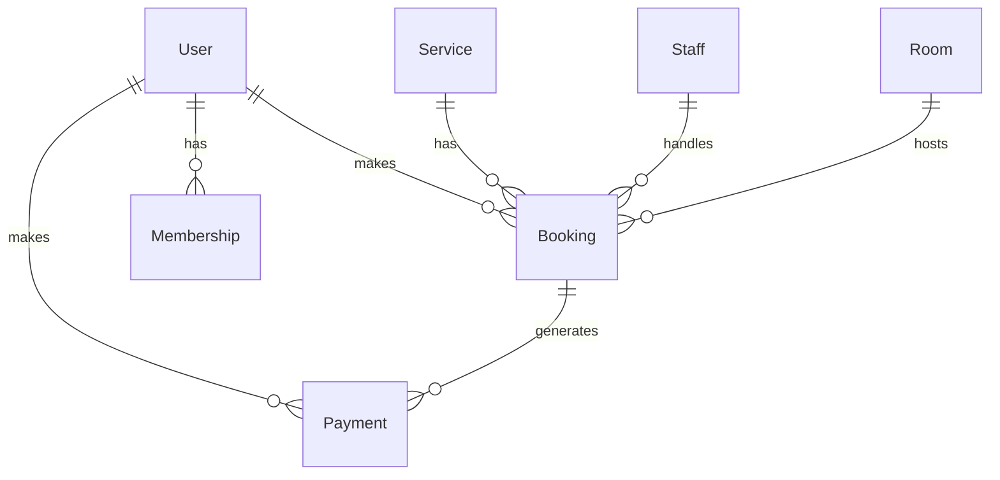

# System Architecture Documentation

## Database Schema

### Entity Relationship Diagram


## Core Components

### 1. Authentication System
- Supabase Auth integration
- Role-based access control
- Session management

### 2. Booking System
- Calendar integration
- Availability checking
- Conflict resolution
- Notification system

### 3. Payment Processing
- Payment gateway integration
- Commission calculation
- Receipt generation
- Refund handling

### 4. Staff Management
- Schedule management
- Performance tracking
- Commission calculation
- Availability management

## API Endpoints

### Authentication
- POST /api/auth/signup
- POST /api/auth/login
- POST /api/auth/logout
- POST /api/auth/reset-password

### Bookings
- GET /api/bookings
- POST /api/bookings
- PUT /api/bookings/:id
- DELETE /api/bookings/:id

### Services
- GET /api/services
- POST /api/services
- PUT /api/services/:id
- DELETE /api/services/:id

### Staff
- GET /api/staff
- POST /api/staff
- PUT /api/staff/:id
- DELETE /api/staff/:id

## Business Logic Implementation

### 1. Booking Management
```typescript
interface BookingLogic {
  checkAvailability(serviceId: string, date: Date): Promise<boolean>;
  assignStaff(booking: Booking): Promise<Staff>;
  allocateRoom(booking: Booking): Promise<Room>;
  processPayment(booking: Booking): Promise<Payment>;
}
```

### 2. Payment Processing
```typescript
interface PaymentLogic {
  calculateCommission(booking: Booking): number;
  processPayment(payment: Payment): Promise<PaymentStatus>;
  generateReceipt(payment: Payment): Promise<Receipt>;
}
```

### 3. Staff Management
```typescript
interface StaffLogic {
  createSchedule(staff: Staff, period: DateRange): Promise<Schedule>;
  calculateCommission(staff: Staff, period: DateRange): Promise<number>;
  trackPerformance(staff: Staff): Promise<PerformanceMetrics>;
}
```

## UI/UX Decisions

### 1. Design System
- Color palette
- Typography
- Component library
- Responsive breakpoints

### 2. User Flows
- Booking process
- Payment process
- Staff management
- Admin dashboard

### 3. Accessibility
- WCAG compliance
- Keyboard navigation
- Screen reader support
- Color contrast

## Security Considerations

### 1. Authentication
- JWT implementation
- Session management
- Password policies
- 2FA support

### 2. Data Protection
- Encryption at rest
- Encryption in transit
- Data backup
- Disaster recovery

### 3. Access Control
- Role-based permissions
- Resource-level access
- Audit logging
- Security monitoring

## Performance Optimization

### 1. Frontend
- Code splitting
- Lazy loading
- Image optimization
- Caching strategy

### 2. Backend
- Query optimization
- Indexing strategy
- Caching implementation
- Load balancing

## Monitoring and Maintenance

### 1. Error Tracking
- Error logging
- Performance monitoring
- User feedback
- Bug reporting

### 2. Analytics
- Usage tracking
- Performance metrics
- User behavior
- Business metrics

## Deployment Strategy

### 1. Environments
- Development
- Staging
- Production

### 2. CI/CD Pipeline
- Automated testing
- Deployment automation
- Version control
- Release management 